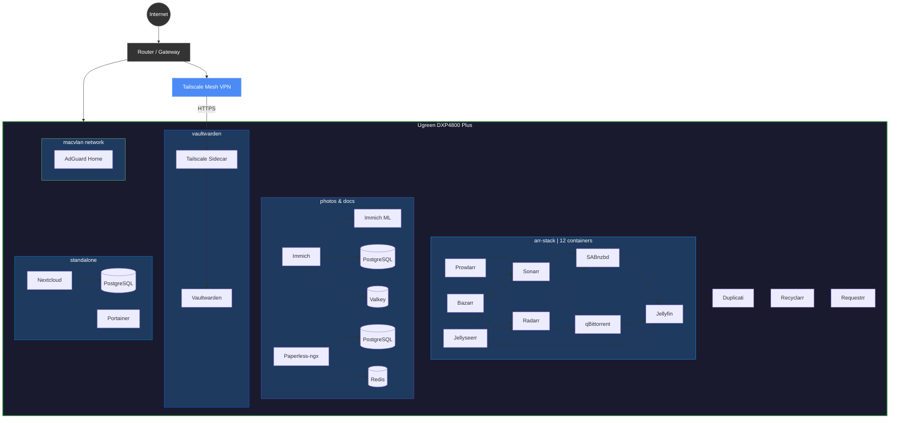
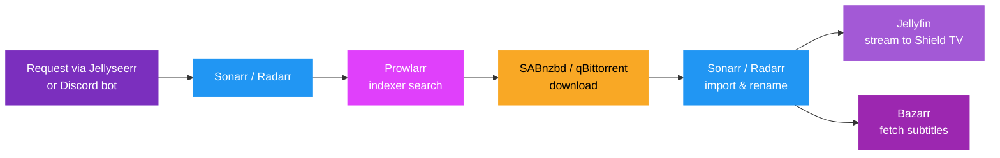
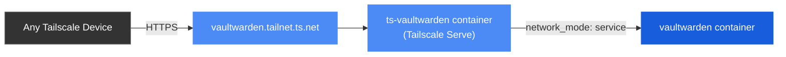

<div align="center">

# Fitz Homelab

**Self-hosted everything on a Ugreen DXP4800 Plus**

Media automation, photo management, document archival, password vault, cloud storage, and network-wide ad blocking - all running on a single NAS.

[](docker-compose/)
[](#docker-compose-stacks)
[](https://tailscale.com/)
[](#hardware)

</div>

---

## The Stack

### Media Automation

> The arr suite - fully automated media acquisition, organization, and subtitle management.

[](https://sonarr.tv/)
[](https://radarr.video/)
[](https://prowlarr.com/)
[](https://www.bazarr.media/)
[](https://recyclarr.dev/)
[](https://github.com/FlareSolverr/FlareSolverr)

### Download Clients

[](https://sabnzbd.org/)
[](https://www.qbittorrent.org/)

### Media Playback

> Jellyfin with hardware transcoding, request management via Jellyseerr, and Discord integration.

[](https://jellyfin.org/)
[](https://github.com/Fallenbagel/jellyseerr)
[](https://github.com/thomst08/requestrr)

### Photos & Documents

> Immich for photos with ML-powered face/object detection. Paperless-ngx for document OCR and archival.

[](https://immich.app/)
[](https://docs.paperless-ngx.com/)

### Cloud & Files

[](https://nextcloud.com/)

### Security & Access

> Vaultwarden with zero exposed ports - only accessible via Tailscale Serve HTTPS. AdGuard as network DNS.

[](https://github.com/dani-garcia/vaultwarden)
[](https://adguard.com/en/adguard-home/overview.html)
[](https://tailscale.com/)

### System & Management

[](https://www.portainer.io/)
[](https://www.duplicati.com/)

---

## Hardware

| | Component | Details |
|---|-----------|---------|
| **NAS** | Ugreen DXP4800 Plus | Intel QuickSync HW transcoding |
| **Storage** | Multi-volume | Configs on Vol 2, Media on Vol 1 |
| **Client** | NVIDIA Shield TV Pro (2019) | HDR10, HDR10+, Dolby Vision |
| **Audio** | LG SN11RG | 7.1.4 Dolby Atmos, TrueHD passthrough |
| **VPN** | Tailscale | Mesh network, zero open ports |
| **DNS** | AdGuard Home | macvlan, dedicated LAN IP |

---

## Architecture



### Media Flow



### Vaultwarden via Tailscale Serve

Zero ports exposed to LAN or internet. The Tailscale sidecar handles all networking:



---

## Recyclarr / TRaSH Guides

Quality profiles synced daily, optimized for the home theater setup:

| Target | Optimization |
|--------|-------------|
| **NVIDIA Shield TV Pro** | HDR10, HDR10+, Dolby Vision (Profile 5/7/8) |
| **LG SN11RG Soundbar** | TrueHD Atmos, DTS-X, DTS-HD MA passthrough |
| **Quality Priority** | Remux > WEB-DL with automatic upgrade paths |
| **Audio Priority** | Lossless first (TrueHD Atmos > DTS-HD MA > DD+ Atmos) |

Custom format definitions: [`recyclarr/custom-formats/`](recyclarr/custom-formats/)

---

## Docker Compose Stacks

| Stack | Containers | Config |
|-------|:----------:|--------|
| **arr-stack** | 12 | [`arr-stack.yml`](docker-compose/arr-stack.yml) |
| **jellyfin-stack** | 1 | Standalone Jellyfin instance |
| **paperless** | 3 | [`paperless.yml`](docker-compose/paperless.yml) |
| **vaultwarden** | 2 | [`vaultwarden.yml`](docker-compose/vaultwarden.yml) |
| **standalone** | ~5 | Nextcloud, Portainer, PostgreSQL |

<details>
<summary><strong>Volume Layout</strong></summary>

```
/volume1/Media/
    Media/
        Movies/
        TV Shows/
        Anime/
        Music/
    Photos/              # Immich library
    Torrents/            # Active downloads
    usenet/              # Usenet downloads
        complete/
        incomplete/
    Backups/             # Duplicati targets

/volume2/docker/
    arr-stack/           # Media automation configs
        sonarr/config/
        radarr/config/
        prowlarr/config/
        jellyfin/config/
        immich/
            postgres/
            model-cache/
        dispatcharr/
        ...
    jellyfin-stack/      # Standalone Jellyfin
    paperless/           # Document management
        data/
        media/
        consume/         # Drop PDFs here for auto-import
        postgres/
    vaultwarden/         # Password manager
        data/
        tailscale/
            state/
            config/      # serve.json for TS Serve
    nextcloud/
    postgres-1/
```

</details>

<details>
<summary><strong>Getting Started</strong></summary>

### Prerequisites

- Docker & Docker Compose on your NAS
- Tailscale account (for remote access & Vaultwarden)

### Setup

1. Clone this repo:
   ```bash
   git clone https://github.com/FitzDegenhub/Fitz-Homelab.git
   cd Fitz-Homelab
   ```

2. Copy and configure your environment:
   ```bash
   cp .env.example .env
   # Edit .env with your actual values
   ```

3. Deploy individual stacks:
   ```bash
   # Media automation
   docker compose -f docker-compose/arr-stack.yml --env-file .env up -d

   # Document management
   docker compose -f docker-compose/paperless.yml --env-file .env up -d

   # Password manager (configure Tailscale auth key first)
   docker compose -f docker-compose/vaultwarden.yml up -d
   ```

</details>

---

## Security

| | Measure | Details |
|---|---------|---------|
|  | **Zero exposed ports** | All remote access via Tailscale mesh VPN |
|  | **Vaultwarden isolated** | Tailscale Serve sidecar - not even on LAN |
|  | **DNS filtering** | AdGuard Home on macvlan with dedicated IP |
|  | **Encrypted backups** | Duplicati with AES-256 encryption |
|  | **Secrets management** | `.env` files with `chmod 600` permissions |
|  | **No secrets in repo** | `.gitignore` blocks all sensitive files |

> **If you fork this:** The `.gitignore` blocks all `.env` files and sensitive configs, but always double-check `git status` before pushing.

---

<div align="center">

### Built With

[](https://www.docker.com/)
[](https://www.linuxserver.io/)
[](https://trash-guides.info/)
[](https://tailscale.com/)

---

[](https://www.reddit.com/r/selfhosted/)
[](https://www.reddit.com/r/homelab/)

*Running on a Ugreen DXP4800 Plus and an unhealthy amount of tinkering.*

</div>
